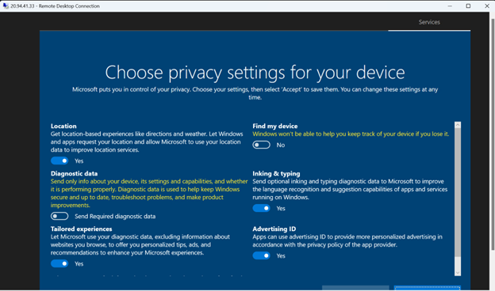

# Microsoft-Azure-Sentinel-Live-CyberAttack-Detection-SIEM-Home-Lab
### Description:
### Welcome to the Azure Sentinel Honeypot Homelab walkthrough!
In this guide, we’ll show you how to build and use a fun and educational cybersecurity lab using Microsoft Azure Sentinel. A honeypot is a fake system set up to attract hackers, so we can watch how they try to attack. It helps us learn about their methods and threats. A SIEM (Security Information and Event Management) is a tool that collects and analyzes security data to help detect and respond to threats in real time. Azure Sentinel is Microsoft’s cloud-based SIEM. It lets us monitor security activity, find threats, and respond automatically. With this lab, you’ll see real attacks from around the world and watch them appear on a live map. It’s a hands-on way to explore the exciting world of cybersecurity!

### Learning Objectives:
* Setting up and rolling out various Azure components including Virtual Machines (VMs), Log Analytics Workspaces, and Azure Sentinel
*	Competence and experience with Microsoft Azure Sentinel, a SIEM (Security Information and Event Management) Log Management Tool
*	Using KQL to query logs
*	Learn how to read the Security Event Logs in Windows
*	Utilize Workbooks (World Map) to make an interactive map showing attack statistics
 
### Utilities Used:
*	Microsoft Sentinel (SIEM)
*	Workbook
*	Watchlist
*	Log Analytic Workspace
*	Microsoft Defender for Cloud
*	Virtual Machines
*	Remote Desktop
*	Event Viewer
*	Firewalls

### Environments Used
*	Microsoft Azure
*	Windows 10 (22H2)
### Links
* Microsoft Azure Free Trial: [Azure](https://azure.microsoft.com/en-us/free/ "Azure")


## Step 1: Create a Microsoft Azure Account:  [Azure](https://azure.microsoft.com/en-us/free/ "Azure")
- Microsoft offers $200 in Azure credit for 30 days when you initially sign up.
- Click on “Go to the Azure Portal” or go to portal.azure.com once you create your account.


## Step 2: Step 2: Create our honey pot virtual machine
- In the search bar of the “Quickstart Center” page > search and click virtual machine
- This will be the honey pot virtual machine made to entice attackers from all over the world
  


## Step 3: On the “virtual machines” page click Create > Azure virtual machine
- Edit the virtual machine as follows:
- Click create a new resource group and name it Honeypot-RG (this resource group is a logical grouping of similar resources)
-	Name the virtual machine: My-Virtual-Machine
-	Under region select: (US) East US 2
-	Under Image select: Windows 10 pro, version 22H2 - Gen2
-	Availability zone: Zones 1
-	Size: Standard_E2s_v3 - 2 vcpus, 16 GiB memory
-	Create a username and password - don’t forget credentials
-	Finally, check the confirmation box - leaving the rest in their default options
  


## Step 4: Click > Next: Disk but leave it as is, click to continue to Networking
-  Click create new under Virtual Network and name it My-Virtual-Network
- Enable the check box for Delete public IP and NIC when VM is deleted
- Click Next: Management -> Click Next: Monitoring
- Disable Boot diagnostics. Then click Review + Create


## Step 5: Go to Resource Groups -> Honeypot-RG -> My-Virtual-Machine-nsg
- Under Inbound Security Rules, you should see a default rule (RDP), click the three dots to the right of it and remove it. 
- Select Add an inbound rule
-	Match the settings of the new rule as follows:
-	Set Destination port ranges: *
-	Priority: 100
-	Name: DANGER_ANY_INBOUND
-	Leave the rest of the settings as default
-	Click Add > OK > Review + create - wait a bit to load and click Create


## Step 6: Log into VM through host machine
- Through the search bar, find our My-Virtual-Machine > copy the Public IP address (highlighted here on the right)
  


- On your Windows machine search and open Remote Desktop Connection
-	Paste your Azure IP into Computer
-	Then, enter your credentials we created for our Azure VM in Step 3, click OK.
-	Accept the certificate warning
-	You should be logged into the VM when you see “Remote Desktop Connection” at the top of the screen. 
-	Click NO to all privacy settings and Accept
-	Set up Edge.



## Step 7: Enter invalid login credentials and observe the logs
- Enter invalid credentials to generate a log. 


-	Search and click Event Viewer
-	Click Windows Logs > Security and find the Audit Failure log (our failed login attempt; if you don’t see it at first filter current log by “Audit Failure” found to the left)
-	The Source Network Address will represent the attacker’s IP address.


## Step 8: Turn off firewall to make VM more susceptible to attack
- Open command prompt on your host machine and try to ping the Azure VM - it shouldn’t work!
-	Search and open wf.msc on Azure VM - remember to keep an eye on VM IP at the very top to confirm you’re in the VM and NOT in on your host to avoid confusion.
-	Click Windows Defender Firewall Properties near the middle of the page
-	Under the Domain Profile > Firewall state: OFF
-	Under Private Profile > Firewall state: OFF
-	Under Public Profile > Firewall state: OFF
-	Try to ping VM again from your host machine - this should now work!


## Step 9 : Provisioning a Log Analytics Workspace 
- Search and click "Log Analytics Workspaces"
-	Click on Create Log Analytics workspace
-	Select the resource group that we created earlier (Honeypot-RG)
-	Give it the name of your choice: Honeypot-LAW.
-	Add to the same region (East US 3)
-	Select Review + Create


## Step 10: Creating a connection between VM and Log Analytics Workspace
- Search and click “Microsoft Sentinel”
- Goto Content management -> Content Hub and search for “Windows Security Event”
- Select the checkbox and click Install


-	Once installed, then click Manage
-	Select the checkbox for Windows Security Events via AMA
-	Then click on Open Connector Page


- Click on Create data collection rule
-	Give it the name of your choice: My-DCR
-	Select the resource group that we created earlier (Honeypot-RG)
-	Click Next: Resources
-	Select and expand Azure subscription1 -> Honeypot-RG -> My-Virtual-Machine
-	Click next and click Review + Create


## Step 11: Query + Extract Fields from Custom Log
- Navigate to the newly established workspace (honeypot-law) in Log Analytics Workspaces -> Logs
-	We then can run a query (KQL) and extract the different data filtering by different fields such as username, country, latitude, longitude, destination host, etc.
-	Observe some of your VM logs:
  
```kql
SecurityEvent
| where EventID == 4625
| where TimeGenerated > ago(5m)
| project TimeGenerated, Account, Computer, EventID, Activity, IpAddress
```


> Kusto Query Language (KQL) is used to query and extract logs from data stored in Azure Log Analytics or Azure Data Explorer. KQL is a powerful and expressive query language that allows you to perform advanced data analysis, filtering, aggregation, and visualization. With some practice composing questions and simple instructions, the language is meant to be simple to read and use.

## Step 12: Create a Watchlist to get the location from an IP address 
- Search and click Microsoft Sentinel
-	Goto Configuration -> Watchlist -> Create
-	Give the name and Alias as “geoip”
-	Then click Next: Source


-	Browse and upload “geoip-summarized.csv” file (which I got it from Josh Madakor’s YouTube channel)
-	Then click Next: Review + Create


## Step 13 : Set up our map within Microsoft Sentinel
- Next, we will map out our logs within Sentinel with the extracted data - to see where in the world our VM is being attacked from.
-	Search and click Microsoft Sentinel > choose Honeypot-LAW and under Threat management choose Workbooks > click + Add workbook
-	Click edit > click the “ … “ on the right side on the screen and remove the two widgets.


-	Click Add > Add query and paste the following into the query:

  ```
{
	"type": 3,
	"content": {
	"version": "KqlItem/1.0",
	"query": "let GeoIPDB_FULL = _GetWatchlist(\"geoip\");\nlet WindowsEvents = SecurityEvent;\nWindowsEvents | where EventID == 4625\n| order by TimeGenerated desc\n| evaluate ipv4_lookup(GeoIPDB_FULL, IpAddress, network)\n| summarize FailureCount = count() by IpAddress, latitude, longitude, cityname, countryname\n| project FailureCount, AttackerIp = IpAddress, latitude, longitude, city = cityname, country = countryname,\nfriendly_location = strcat(cityname, \" (\", countryname, \")\");",
	"size": 3,
	"timeContext": {
		"durationMs": 2592000000
	},
	"queryType": 0,
	"resourceType": "microsoft.operationalinsights/workspaces",
	"visualization": "map",
	"mapSettings": {
		"locInfo": "LatLong",
		"locInfoColumn": "countryname",
		"latitude": "latitude",
		"longitude": "longitude",
		"sizeSettings": "FailureCount",
		"sizeAggregation": "Sum",
		"opacity": 0.8,
		"labelSettings": "friendly_location",
		"legendMetric": "FailureCount",
		"legendAggregation": "Sum",
		"itemColorSettings": {
		"nodeColorField": "FailureCount",
		"colorAggregation": "Sum",
		"type": "heatmap",
		"heatmapPalette": "greenRed"
		}
	}
	},
	"name": "query - 0"
}
```

> This will parse through the failed RDP’s logs and return to us location information through our custom fields we created.


## Step 14: Finish/save threat visualization
- Hit > save and close
-	Hit the floppy disk at the top to save the map.
-	Title: VM Attack Map > Location: (US) East US -> Resource group: Honeypot-RG -> click Apply
-	And we’re done! - by now people should be attacking your VM, congrats!
-	You can hit the refresh icon near the top of the map to load more logs into the map
-	Also, you can click Auto refresh ON to refresh every so often.


> Quick explanation of script: the script will parse through the security event logs (Audit Failure/failed login logs we looked at earlier) and grab IP information. The script then **passes** the IP thorough the API and correlates the info into longitude and latitude, giving us specific geographical information. 

## Step 15: Deprovision resources
- Look for "Resource groups" -> name of resource group
-	Copy and paste the name  of the resource group (Honeypot-RG) to verify removal of resources
-	Select the Apply force delete for selected Virtual machines and Virtual machine scale sets box
-	Click Delete


